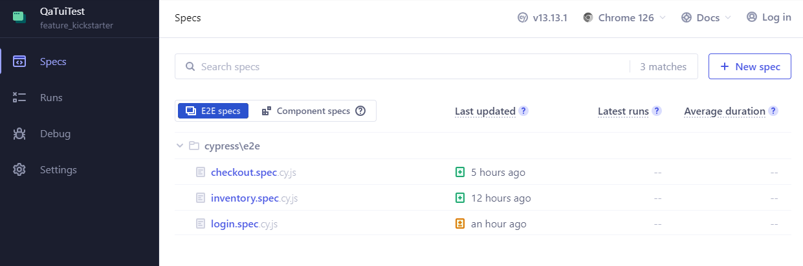
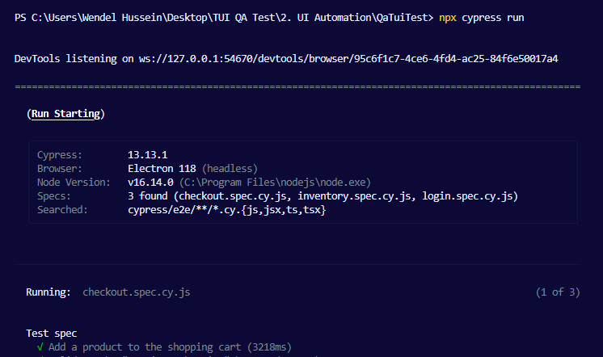
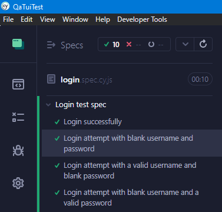
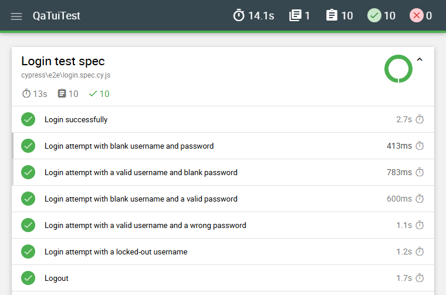

# QaTuiTest UI Automation
QA Test for TUI

[](https://www.cypress.io/)

## Contents

-   Local Setup
    -   [Prerequisites](#prerequisites)
    -   [Installation](#installation)
    -   [Run tests locally](#run-tests-locally)
        -   [Cypress GUI Headed](#cypress-gui-headed)
        -   [NPM Scripts Headless](#npm-scripts-headless)
    -   [Test results](#test-results)

## Local Setup

### Prerequisites

- Have node.js installed.

    📝 If not, install via https://nodejs.org/en/download, and select your OS version. On the installer, just click "Next" until "Finish". Verify the node is installed using the command "node -v" on a terminal.

### Installation

```
npm install
```

### Run tests locally

#### Cypress GUI Headed

Cypress can be executed using its UI, for that, just use the bellow command, a window will open, choose the testing type, next choose the desired browser and click on a spec file to start test execution.

```
npx cypress open
```

<p align="center">
    
</p>

> [!WARNING]
> <font color="yellow">⚠️ Cypress is currently having some issues managing sessions in recent versions of Firefox, so since I'm using session management in the tests, it's not advisable to use it at the moment.</font>

#### NPM Scripts Headless

We also created NPM scripts to easily trigger cypress execution through command line, take a look at [package.json](./package.json) to see all available scripts.

Some exemples:

To execute all spec files:

```
npx cypress run
```

<p align="center">
    
</p>

To select a browser to run the tests on (e.g.: chrome):

```
npx cypress run --browser chrome
```

To execute only one spec file, in this case the login.spec:

```
npx cypress run --spec "cypress/e2e/login.spec.cy.js"
```

You can also chain commands, for exemple select the browser and specify a spec file to run:

```
npx cypress run --browser chrome --spec "cypress/e2e/login.spec.cy.js"
```

More information about running cypress can be found at official documentation https://docs.cypress.io/guides/guides/command-line

### Test results

After the tests, the results can be analyzed straight forward.

If you open the tests via UI (headed mode) it will be displayed at the Cypress screen, you can follow it while still running.

<p align="center">
    
</p>

If you run the test via command line (headless mode) it will be displayed at the terminal screen, you can also follow it while still running, although with less detail than in the UI mode, the errors will still be logged with some details.

💡 Additionally, when running the tests via command line, a report in .html will be created at 'cypress/reports'.

<p align="center">
    
</p>
